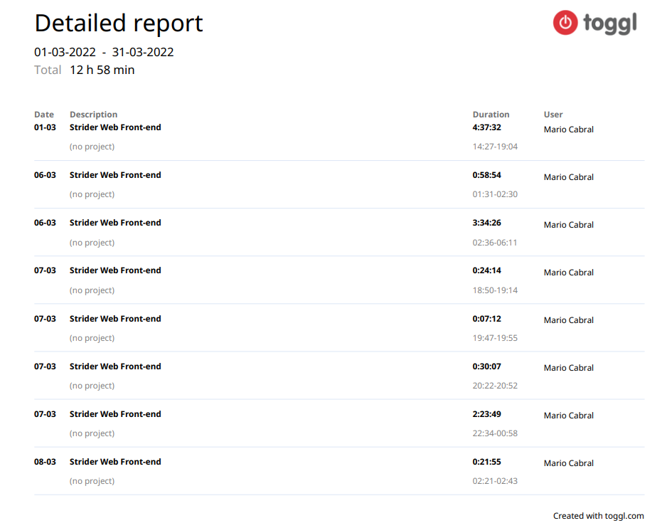

This is the Strider Web Front-end Assessment - 2.0, and this code was made by Mario Sergio.

## Getting Started

First of all, you need to install [Docker Desktop](https://www.docker.com/products/docker-desktop) to build the container and run this project. After install it, you just need
to execute this line of code on your terminal:

```bash
docker-compose up
# or
docker compose up
```

Open [http://localhost](http://localhost) with your browser to see this project running.

## Time spent (in one week)



## Planning

This section will treat about the "reply-to-post" feature.

### Questions
- This "@ mentioning" will be the username of the owner of the original post, or will be anything else?
- Can an user reply a post as much as he wants, or there's a limit?
- Every reply post will show all replies that an user made or just one reply for post?
- Can an user only use text to reply a post? Or can he send images, links, videos, etc.

### Solution
- First of all we need to create a document/table to store the replies to an post. Saving the message of reply and the reference to the original post.
- Update/create an route in backend to create this reply and make possible to users use this feature.
- In frontend, we need to create a new function in service of posts to communicate to backend and make possible to use this new route.
- Create a new post component, that includes this replies, and make possible to add as much replies as we need.
- Integrate the component and the service to do this feature.
- Create tests e2e to make sure that all that was implemented is working properly.

## Critique

In this section I will point all things that I want to improve/fix in this project.

- Get more time to implement all of tests e2e and ensure the quality, using cypress.
- Implements an application that communicates to a real api, creating databases and making this more than a test, a real project that can be useful in future by the architecture used in this.
- Creating components more reusable and modularize more the responsability of each part of this code.
- Use different design architectures, like atomic design.
- Optimize the SEO of this site, using the right tags and descriptions.
- Improve the performance of the usage of modal routing in Next.js, that I had to use in this project but I never used it before.
- Use the storybook lib to document each component.
- Use Next.js optimization of Images and Fonts to improve the performance of this website.
